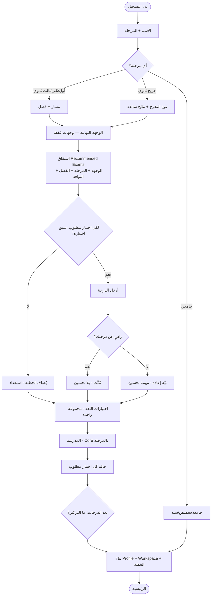

# ADR-0001 — منطق التسجيل (المرجع النهائي)

- **الحالة:** ✅ معتمَد (٢٠٢٦-٠٧-١٤) — المرجع الرسمي الوحيد لمنطق التسجيل.
- **المخطّط المرئي المرافق:** Flow Chart كامل (Profile → Recommended Exams → الخطة).
- **النطاق:** منطق التسجيل فقط. لا يمسّ إعادة بناء مساري (مؤجَّلة حتى استقرار التسجيل).

---

## 0. قاعدة الحوكمة (إلزامية)

هذه الوثيقة هي **المصدر الرسمي الوحيد** لمنطق التسجيل واشتقاق الاختبارات.

1. أي ميزةٍ مستقبلية **يجب أن تلتزم بهذه الوثيقة**.
2. **يُمنع** أي `if` خاص أو منطقٌ جانبيٌّ خارج ما تنصّ عليه هذه الوثيقة.
3. عند الحاجة لتغيير المنطق: **يُعدَّل هذا المستند أولاً، ثم الكود** — لا العكس.
4. المنطق المشترك (اشتقاق الاختبارات، حالتها، نيّة الإعادة) يعيش في **مصدرٍ واحد** يقرؤه الجميع (لا تكرار).

---

## 1. المبادئ النهائية السبعة

1. **Profile يبنيه التسجيل فقط.**
2. **Workspace (مساري) يبنيه الطالب فقط.**
3. **الوجهة هي المدخل الوحيد للمنطق.**
4. **Recommended Exams تُشتق من الوجهة، وليست Goal.**
5. **الاختبارات وسائل** للوصول إلى الوجهة، لا أهدافاً بحدّ ذاتها.
6. **مصدرٌ واحد للقراءة:** دويرب · الرئيسية · الخطة · الإشعارات · مساري تقرأ جميعها من:
   `Recommended Exams` + `نتائج الطالب` + `نيّة الإعادة` — ولا منطق مكرّر خارجه.
7. **كل سؤالٍ في التسجيل يجب أن يغيّر قراراً فعلياً في الخطة، وإلا يُحذف/يُؤجَّل.**

---

## 2. محرّك الاختبارات المطلوبة — Recommended Exams

التسلسل الداخلي الثابت:

> **الوجهة → الاختبارات المطلوبة → حالة كل اختبار → الخطة**

النظام يشتقّ داخلياً قائمة `recommendedExams`؛ الطالب **لا** يختار «تحسين القدرات» كهدف —
بل يستنتج النظام أن القدرات **مطلوبة** للوصول إلى الوجهة.

### 2.1 الاشتقاق

```
recommendedExams = eligibility( requirementsOf(destinations), stage, term, windows )
```

- `requirementsOf(destinations)`: ما تتطلّبه الوجهة (الجدول أدناه).
- `eligibility(...)`: تصفيةٌ بالمرحلة + الفصل + النافذة الرسمية (المصدر: `examEligibility` + `examProvider`).
  فما تتطلّبه الوجهة لكنه غير مؤهَّل للمرحلة **لا يُقترَح الآن** (مثال: أول ثانوي لا قياس مهما كانت الوجهة).

### 2.2 الوجهة → ما تتطلّبه

| الوجهة | الاختبارات المطلوبة |
|---|---|
| دخول جامعة / تخصص | قدرات + تحصيلي (التحصيلي للتخصصات العلمية/الصحية) · درجة الثانوية للموزونة |
| أرامكو | قدرات + تحصيلي + برنامج أرامكو |
| ITC | قدرات + ITC |
| NITI | قدرات + NITI |
| ابتعاث | قدرات/تحصيلي + اختبار لغة (IELTS/TOEFL) |
| وظيفة | حسب الجهة — غالباً لغة (+ قياس إن لزم) |
| تطوير الإنجليزية | مجموعة اختبارات اللغة فقط (بلا قياس مفروض) |

### 2.3 حالة كل اختبار (Exam State)

لكل اختبارٍ مطلوب حالةٌ واحدة:

- `required` — مطلوبٌ ولم يبدأ.
- `untested` — لم يُختبر (أضافه لخطته / استعداد).
- `scored-satisfied` — له درجةٌ والطالب راضٍ عنها → **لا اقتراح تحسين**.
- `scored-retake` — له درجةٌ والطالب غير راضٍ → **نيّة إعادة** (مهمة «تحسين»).

### 2.4 المصدر الواحد للقراءة

`دويرب · الخطة · الرئيسية · الإشعارات · مساري` تقرأ من:

```
recommendedExams  +  نتائج الطالب (الدرجات)  +  نيّة الإعادة (retakeIntent)
```

لا يوجد حقل `goal` للاختبار، ولا منطق أهليةٍ مكرّر خارج هذا المصدر.

### 2.5 طبقة التوافق (Compatibility Layer) — `track` / `activeTracks`

`recommendedExams` هو **المصدر الحقيقي الوحيد**. الحقلان `track`/`activeTracks` مجرّد
**View مُشتقّة** منه، تبقى مؤقتاً للحفاظ على عمل مساري الحالي خلال المرحلة الانتقالية،
بالشروط الملزِمة:

- **لا منطق خاصٌّ به** — لا قاعدة تُحسب منه.
- **لا يُكتب إليه مباشرة** — يُشتقّ فقط من `recommendedExams`/المقبول.
- **لا قرار جديد يقرأ منه** — كل منطقٍ جديد يقرأ `recommendedExams`.
- يُزال **نهائياً** بمجرد حذف آخر مستهلكٍ له (بعد إعادة بناء مساري).

### 2.6 سؤال التركيز — يبني الخطة الأولى فقط

بعد إدخال كل الدرجات وأسئلة الرضا، سؤالٌ واحد للتركيز يبني **الخطة الأولى فقط**
و**لا يغيّر الوجهة**. خياراته (حسب ما يخصّ الطالب):

`تحسين القدرات · تحسين التحصيلي · اللغة الإنجليزية · القبول الجامعي · البرامج`

يُخزَّن في `Profile.focus`. **نيّة الإعادة** (`retakeIntent`) تُلتقط من سؤال الرضا بعد كل
درجة (لا Goal)، وتُخزَّن في `Profile.retakeExams`، ويقرؤها محرّك الحياة/الخطة.

---

## 3. قواعد اقتصاد الأسئلة

1. **كل سؤال يغيّر الخطة** — إن كان الجواب لن يغيّر قراراً لاحقاً، فلا يُسأل.
2. **لا سؤالين لنفس النتيجة** — إن عرّفت الوجهةُ أن القدرات مطلوبة، فلا سؤال إضافي عنها.
3. **المؤجَّل لا يُثقِل التسجيل** — أي معلومةٍ تُعدَّل لاحقاً تُكمَّل داخل المنصة.
4. **الرضا يبقى في التسجيل** — يؤثّر مباشرةً على الخطة الأولى.

### تدقيق أسئلة التسجيل

| السؤال | يغيّر الخطة؟ | القرار |
|---|---|---|
| الاسم + المرحلة | يقود كل شيء | **يبقى** |
| الوجهة | يشتقّ الاختبارات المطلوبة | **يبقى — المحور** |
| الفصل الدراسي | يحكم التحصيلي المبكر | **يبقى** |
| سبق اختباره؟ + الدرجة | يحدّد حالة الاختبار | **يبقى** |
| الرضا عن الدرجة | يحدّد نيّة الإعادة | **يبقى** (قاعدة ٤) |
| اختبارات اللغة | اختيار وسيلة للوجهة | **يبقى** (اختياري) |
| ساعات المذاكرة | يقود الجدول | **يبقى** — افتراض ٣ |
| المسار الدراسي | يرتّب أولويات المواد | **يبقى إن غيّر قراراً، وإلا يُؤجَّل** |
| درجة الثانوية | للموزونة (وجهة قبول فقط) | **مشروط بالوجهة** (قاعدة ٢) |
| المنطقة/المدرسة | لا يغيّر الخطة الآن | **يُؤجَّل للمنصة** (قاعدة ٣) |
| موعد الاختبار | قابل للتعديل لاحقاً | **يُؤجَّل للمنصة** (قاعدة ٣) |
| المدينة/الجوال | قابل للتعديل لاحقاً | **يُؤجَّل للمنصة** (قاعدة ٣) |

---

## 4. مصفوفة الحالات (شاملة)

| المرحلة | خطوة التفاصيل | الوجهات | Recommended Exams (قياس) | اللغة | المدرسة | الناتج المميّز |
|---|---|---|---|---|---|---|
| **أول ثانوي** | مسار + فصل | جامعة/تخصص · تطوير الإنجليزية | **لا قياس** (يبني أساسه) | مجموعة (اختياري) | 🏫 Core | Profile بلا قياس · Workspace = المدرسة (+ لغة إن اختار) |
| **ثاني ثانوي** | مسار + فصل | جامعة/تخصص · تطوير الإنجليزية | القدرات · التحصيلي المبكر (إن مستهدف + بعد الفصل الأول + نافذته مفتوحة) | مجموعة | 🏫 Core | Workspace = المدرسة + القدرات (+ مبكر/لغة) |
| **ثالث ثانوي** | مسار + فصل + وجهة القبول | كل الوجهات | القدرات · التحصيلي (مبكر ثم عادي بعد إغلاق نافذته) | مجموعة | 🏫 Core | بعد الدرجات: رضا/إعادة/تركيز → الخطة (لا قفز للقبول) |
| **خريج ثانوي** | نوع التخرج + نتائج سابقة | كل الوجهات | قدرات/تحصيلي فقط إن اختار التحسين؛ وإلا تركيز القبول | مجموعة | لا مدرسة (ليست Core للخريج) | Workspace بلا قياس مفروض إن ركّز على القبول |

> **القدرات دائماً 🟢 مفتوح** (محوسب طوال السنة) لمن يخصّه — لا «مغلق/بانتظار». التحصيلي موسمي فقد يظهر «بانتظار». (لا «مغلق» للقدرات إلا الورقي صراحةً.)

---

## 5. مخطّط التدفّق



---

## 6. الناتج النهائي

### 👤 Profile — يبنيه التسجيل
- المرحلة + الفصل · المنطقة + المدرسة (مؤجَّلة، تُكمَّل لاحقاً)
- الوجهات (نهائية، متعددة)
- الدرجات السابقة لكل اختبار
- نيّات الإعادة (اختبارات غير راضٍ عنها)
- التركيز + الساعات + الرغبات

### 🧭 Workspace — يبنيه الطالب
- Core: المدرسة (ثانوي) / الجامعة (جامعي) — تلقائية بالمرحلة
- الاختبارات المطلوبة المقبولة (اختار «ابدأ الآن»)
- مجموعة اللغة إن اختار منها
- مهام التحسين للاختبارات غير الراضٍ عنها
- لا شيء يُفرض — أول ثانوي = المدرسة فقط

---

## 7. ترتيب التنفيذ

1. **الأهداف → وجهات فقط** — إزالة أهداف الاختبارات (StudyGoalType: qudurat/tahsili/step) وتوحيد قسمَي الأهداف.
2. **`recommendedExams`** — مصدرٌ واحد يشتقّ الاختبارات من الوجهة + المرحلة + النوافذ (مفهوم الاختبار حيّ داخلياً، لا `goal`).
3. **الرضا/الإعادة بعد الدرجة** + **سؤال التركيز** بعد الدرجات (ثالث/خريج).
4. **ترشيق التسجيل** بقواعد اقتصاد الأسئلة (تأجيل المنطقة/المدرسة/الموعد/الجوال · ربط درجة الثانوية بالوجهة).
5. **قراءة المستهلكين** (دويرب/الخطة/الرئيسية/الإشعارات) من المصدر الواحد.

> **لا يُلمس مساري ولا تُعاد بناء واجهته** حتى يكتمل منطق التسجيل ويصبح مستقراً.
> نظام الوحدات (`src/lib/modules/`) يبقى خاملاً حتى مرحلة إعادة البناء.

---

## القرار
معتمَد كمرجعٍ نهائي. أي انحرافٍ عنه في الكود = خطأ يُصحَّح، لا استثناءٌ يُضاف.
